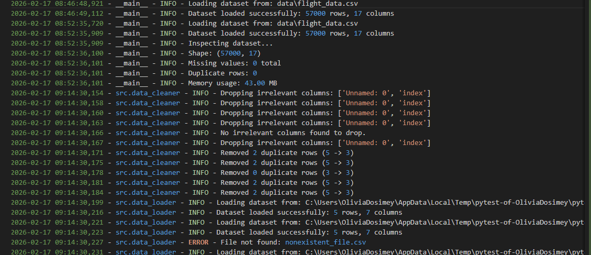
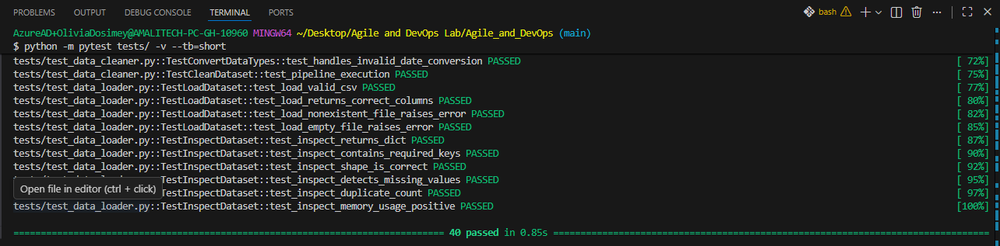
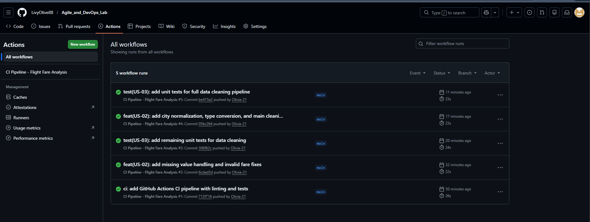

# Sprint 1 Review

**Date:** 2026-02-17
**Sprint Goal:** Deliver first increment of working software (Data Loading & Cleaning) and establish DevOps pipeline.

## 1. Summary of Work Completed

I successfully completed all planned User Stories for Sprint 1, delivering a functional data processing pipeline with automated testing and CI integration.

| ID | User Story | Status | Story Points |
|----|------------|--------|--------------|
| US-01 | Data Loading & Inspection | Done | 2 |
| US-02 | Data Cleaning & Preprocessing | Done | 4 |
| US-03 | Data Validation & Quality Assurance | Done | 2 |

**Total Story Points Delivered:** 8/8

## 2. Key Deliverables

### A. Data Loader Module (`src/data_loader.py`)
- Implemented `load_dataset` to safely read CSV files.
- Implemented `inspect_dataset` to generate a summary report (shape, missing values, duplicates).
- **Evidence:**
  

### B. Data Cleaning Pipeline (`src/data_cleaner.py`)
- Implemented a robust cleaning pipeline that:
    - Drops irrelevant columns
    - Removes duplicates
    - Converts data types (Float, DateTime)
    - Imputes missing values (Median/Mode)
    - Fixes invalid logic (e.g., negative fares)
    - Normalizes city names (e.g., "Dacca" -> "Dhaka")

### C. Automated Testing (`tests/`)
- Created 40 unit tests covering all functions.
- Implemented `TestLoadDataset`, `TestInspectDataset`, `TestCleanDataset` (Integration).
- **Evidence:**
  

### D. CI/CD Pipeline (`.github/workflows/ci.yml`)
- Configured GitHub Actions to automatically run:
    - Linting (`flake8`)
    - Unit Tests (`pytest`)
- **Evidence:**
  

## 3. Demo Script

To verify the Sprint 1 increment, run the following commands:

# 1. Inspect the raw data
python -m src.data_loader

# 2. Run the tests to verify cleaning logic
python -m pytest tests/ -v

## 4. Definition of Done (DoD) Checklist

- [x] Code fulfills the requirements of the User Story.
- [x] Code follows python best practices (PEP 8 compliant, linted with flake8).
- [x] Unit tests are written and passing (40 tests passed).
- [x] CI pipeline is passing on the main branch.
- [x] Documentation is updated.

## 5. Next Steps (Sprint 2 Preview)

- **US-04:** Exploratory Data Analysis (EDA) & Visualizations.
- **US-05:** Pipeline Monitoring & Logging (Enhancement).
- **US-06:** Final Reporting.
