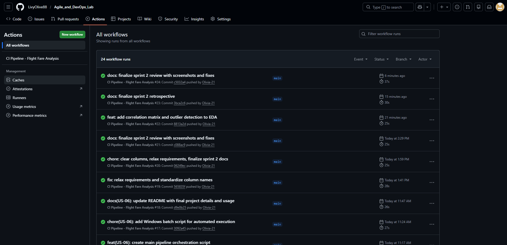
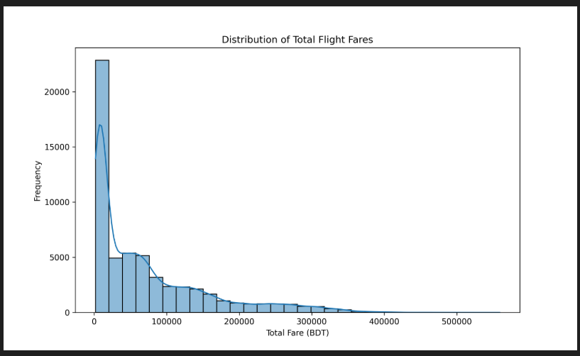
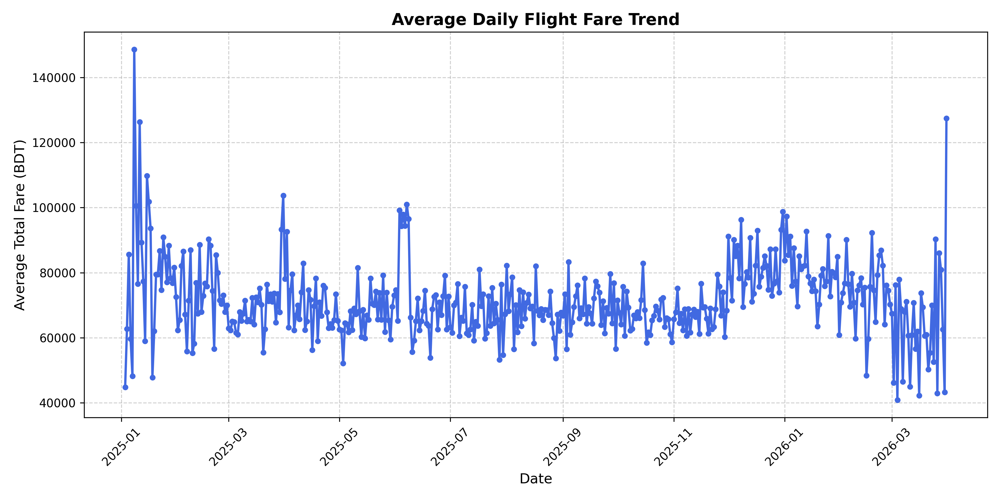
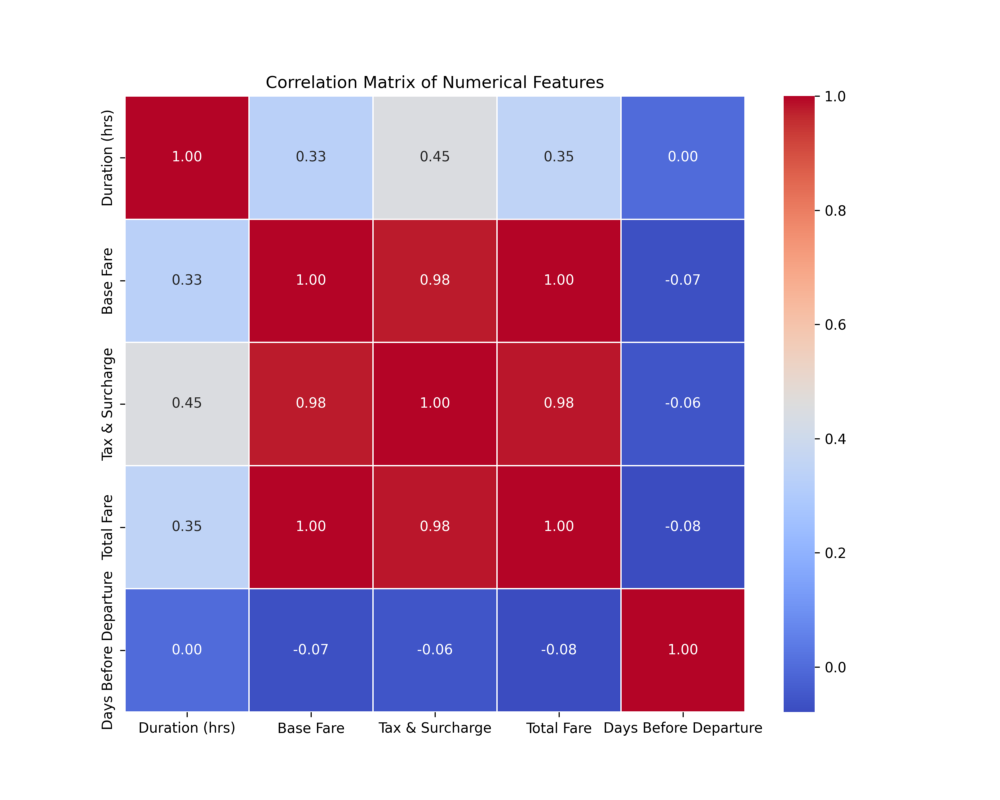
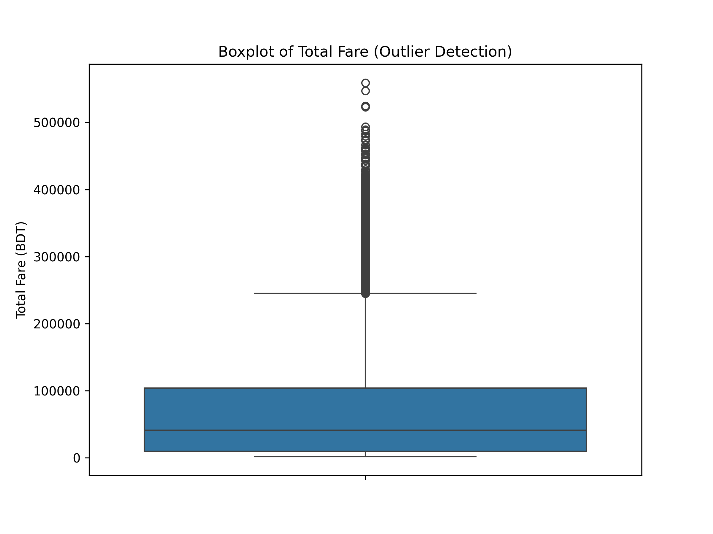
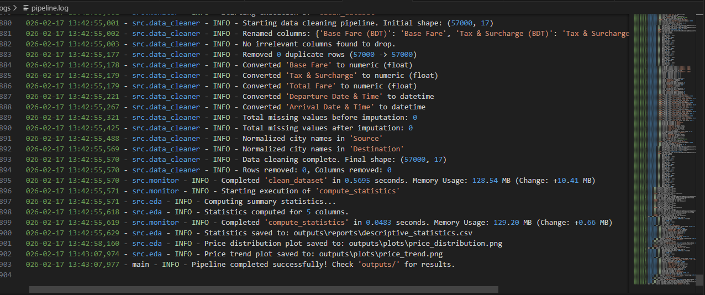

# Comprehensive Sprint Review Report (Sprints 1 & 2)

**Final Completion Date:** 2026-02-17
**Project:** Flight Fare Analysis Pipeline
**Objective:** Apply Agile and DevOps principles to build an automated flight data analytics pipeline.

---

## Part 1: Sprint 1 Review - Foundation & Pipeline Setup

### 1.1 Summary of Work Completed
Sprint 1 focused on creating the core infrastructure: data loading, cleaning, and the initial CI/CD setup.

| ID | User Story | Status | Story Points |
|----|------------|--------|--------------|
| US-01 | Data Loading & Inspection | Done | 2 |
| US-02 | Data Cleaning & Preprocessing | Done | 4 |
| US-03 | Data Validation & Quality Assurance | Done | 2 |

**Total Story Points Delivered:** 8/8

### 1.2 Key Deliverables & Evidence

**A. Data Loader & Preprocessing**
- Implemented `src/data_loader.py` and `src/data_cleaner.py`.
- **Evidence (Data Load):**
  

**B. Automated Testing & CI/CD**
- High test coverage with 40+ unit tests.
- Automated pipeline via GitHub Actions.
- **Evidence (Testing & CI):**
  
  
  

---

## Part 2: Sprint 2 Review - EDA, Monitoring & Finalization

### 2.1 Summary of Work Completed
Sprint 2 focused on analytics, performance tracking, and finalizing the project for delivery.

| ID | User Story | Status | Story Points |
|----|------------|--------|--------------|
| US-04 | Exploratory Data Analysis (EDA) | Done | 5 |
| US-05 | Pipeline Monitoring & Logging | Done | 3 |
| US-06 | Final Reporting & Documentation | Done | 2 |

**Total Story Points Delivered:** 10/10

### 2.2 Key Deliverables & Evidence

**A. Advanced EDA & Visualizations**
- Generated distributions, trends, correlation matrices, and outlier detection.
- **Evidence (EDA Plots):**
  
  
  
  

**B. Performance Monitoring**
- Integrated `@track_performance` decorator for real-time observability.
- **Evidence (Logs):**
  

**C. Final Orchestration**
- End-to-end execution script (`main.py`) and Windows batch runner.

---

## Part 3: Project Demo & Verification

### 3.1 Execution Instructions
To verify the entire project end-to-end:
1. Run the automated runner:
   ```bash
   .\run_pipeline.bat
   ```
2. Review outputs in the `outputs/` folder (Reports and Plots).
3. Review performance metrics in `logs/pipeline.log`.

---

## Part 4: Final Definition of Done (DoD) Checklist

- [x] **Functionality:** Code fulfills all User Story requirements.
- [x] **Quality:** Passes `flake8` linting and PEP 8 standards.
- [x] **Testing:** Comprehensive test suite (47+ tests) passed successfully.
- [x] **DevOps:** CI/CD pipeline integrated and passing.
- [x] **Documentation:** README and all Sprint artifacts completed.

## Part 5: Project Conclusion
The project successfully demonstrates how a data engineering pipeline can be developed iteratively using Agile methodologies (Scrum) while maintaining high engineering standards through DevOps automation.
